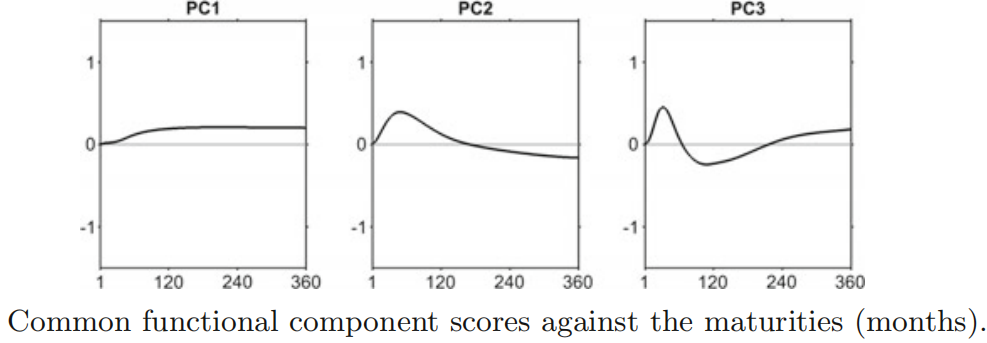
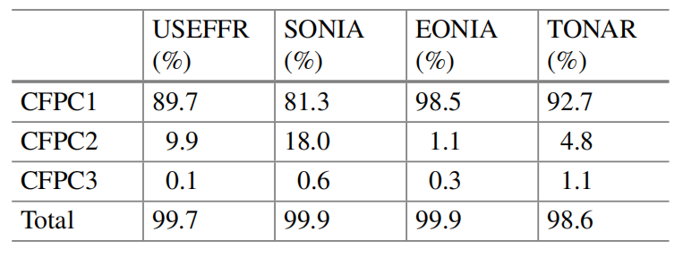

# CFPCA_code for 1-day ahead International Yield Curve Prediction

## Description

This project proposes an international yield curve predictive model, where common
factors are identified using the common functional principal component (CFPC)
method. For the 1-day ahead out-of-sample forecasts of the US, Sterling, Euro
and Japanese yield curve from 07 April 2014 to 06 April 2015, the CFPC factor
model is compared with several alternative factor models based on the functional principal
component analysis. 

The code was first published with the paper "International Yield Curve Prediction with Common Functional Principal Component Analysis" by Robustness in Econometrics in 2017. The data unfortunately is not accessible now.

Here's a breakdown of what the codes do.

## Usage

1. Place the CFPCA_code folder in your MATLAB working directory. 
2. Run the script in MATLAB to clean and structure the input data:
   ```matlab
   dataInput_151013.m  %Input data prepration;
   ```
3. Run the script in MATLAB to estimation the PCA forecasting models:
   ```matlab
   modelEstimation_151118.m  %MODELESTIMATION;
   ```
4. Run the script in MATLAB to estimation the PCA forecasting models:
   ```matlab
   PCAforecastAr1.m  %Model forecasting;
   ```

## Model Estimation (`modelEstimation_151118.m`)

This MATLAB script computes and compares several yield curve modeling techniques, saving results to files and generating visualizations.

### Description

The script performs the following analyses:
- Dynamic Nelson-Siegel Model
- PCA (multivariate) of separate datasets
- PCA (multivariate) of combined dataset
- CPC model (multivariate)
- FPCAs of separate data sets using spline basis
- CFPCA using spline basis
- Summary comparison of all models

### Features

1. **Multiple Modeling Techniques**:
   - Traditional statistical methods (PCA)
   - Functional data analysis approaches (FPCA, CFPCA)
   - Financial economics model (Dynamic Nelson-Siegel)

2. **Visualization**:
   - Generates plots for factor loadings, principal components, and scores
   - Creates summary comparison plots
   - Saves figures in PNG format

3. **Data Handling**:
   - Works with multiple country datasets simultaneously
   - Performs spline estimation and mean correction

4. **Output**:
   - Saves model results to MAT files
   - Exports explained variation metrics to Excel files
   - Generates comprehensive visualizations

### Output Files

The script generates several output files:

#### Data Files (`Variables/`):
- `model_dns.mat`            - Dynamic Nelson-Siegel results  
- `model_pca.mat`            - PCA results for separate datasets  
- `model_pca_comb.mat`       - PCA results for combined dataset  
- `model_cpc.mat`            - CPC model results  
- `model_fpca.mat`           - FPCA results  
- `model_fpca_comb.mat`      - Combined FPCA results  


## AR(1) Forecasting for DNS, CPC, combFPCA, and CFPC Models (`PCAforecastAr1.m`)
This MATLAB script performs AR(1) forecasting for four different yield curve modeling approaches:
- 1. Dynamic Nelson-Siegel (DNS)
- 2. Common Principal Components (CPC)
- 3. Combined Functional Principal Components Analysis (combFPCA)
- 4. Common Functional Principal Components (CFPC)

The script generates 1-day ahead and 5-days-ahead forecasts, calculates error metrics, and saves results in Excel files and MATLAB data files.

### Features
- Computes descriptive statistics for factors and scores
- Generates forecasts for:
  - DNS factors
  - CPC scores
  - combFPCA scores
  - CFPC scores
- Calculates Root Mean Square Error (RMSE) and Mean Absolute Deviation (MAD) metrics
- Saves forecast results in Excel format (.xls)
- Generates forecast visualization plots (.png)
- Stores complete forecast models in MATLAB data files (.mat)


### Error Metrics
  - RMS_Scores: Root Mean Square Error for scores
  - RMS_Maturities: RMSE for maturities
  - RMS_Curves: RMSE for entire curves
  - MAD_Scores: Mean Absolute Deviation for scores
  - MAD_Maturities: MAD for maturities 
  - MAD_Curves: MAD for entire curves

### Results illustration
**Figure 1**: Common functional component scores against the maturities (months).



**Figure 2**: Explained variation of the first three common functional factors.




## Author & Contact  
- **Author**: Jiejie Zhang, National University of Singapore
- **Date**: 2017-10-03
- **Contact**: jiejiezhangsta@gmail.com
