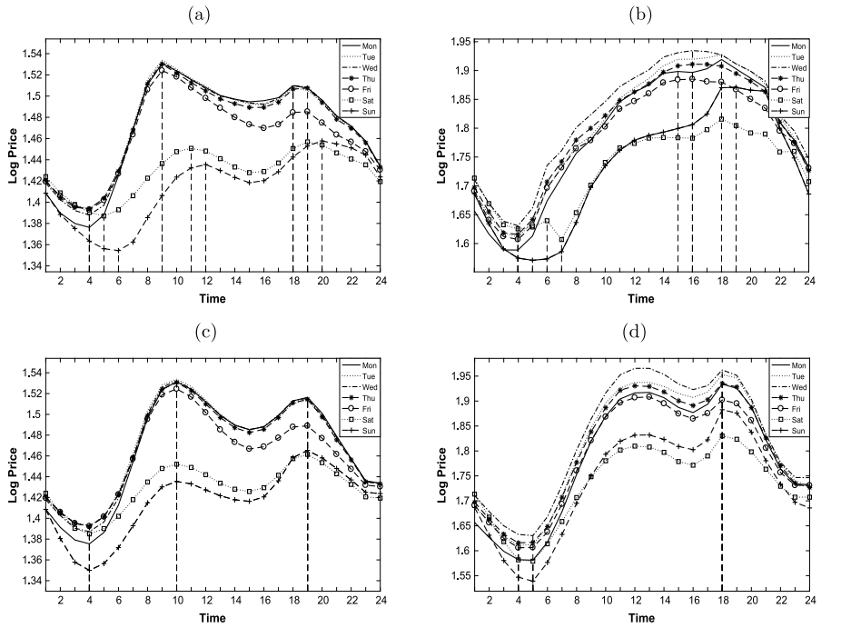
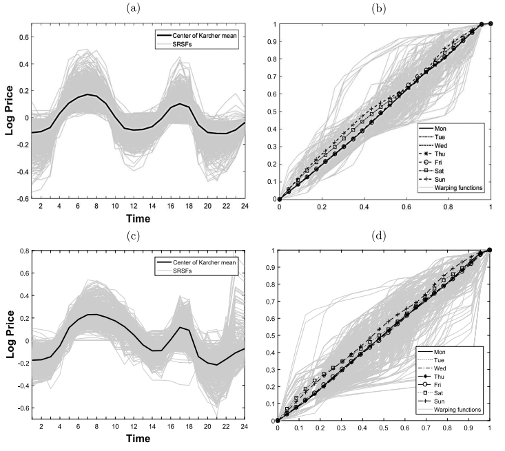

---

# WFAR.m – MATLAB code for Warping Functional AutoRegressive (WFAR) Model (NorD Pool market) 

## Description  
This MATLAB code proposes a noval time series forecasting model (namely, WFAR model) for high dimensional, high frequency and seasonal time series data, in particular, the 1-day ahead electricity price. The code further performs a comprehensive comparison of various time series forecasting models e.g. FAR, VAR, AR*, SAR, ARX* models against the proposed WFAR model.

The electricity price data from two power markets are used: (1) the Nord Pool market from 2013.01.01 to 2017.12.31, via WFAR.m (2) the California market from 1999.07.05 to 2001.01.31, via WFAR_CA.m. This code was originally published with the paper: "Modeling Seasonality and Serial Dependence of Electricity Price Curves with Warping Functional Autoregressive Dynamics" by The Annals of Applied Statistics in 2019.

Here's a breakdown of what the code does.

## Notable Features:
This code implements the WFAR model that handles intraday patterns through time warping,and provides a rigorous comparison of functional data approaches and traditional autoregressive/econometric models for electricity price forecasting.

1. The time warping approach splits the typical daily price pattern (seasonal) variations by day of week from the price level variations.
2. The function autoregressive model (FAR) is applied on the seasonal-adjusted price values.
3. The day of week effects (calendar effects) are properly addressed through fixed warping function, as shown by the improvement of forecast accuracy.
4. The WFAR model is fast and applicable to other seasonal time series in financial market.

## Usage  
1. Place the WFAR_code folder in your MATLAB working directory.  
2. Ensure the existence of subfolder NPdata containing the input data from Nord Pool website.
3. Ensure the existence of subfolder fdaM containing the source functions.  
4. Run the script:  
   ```matlab
   WFAR.m;
   ```  
5. Similarly, run the script for California market:  
   ```matlab
   WFAR_CA.m;
   ```  

## Key Components:
1. **Data Preparation**:
   - Load electricity price data and applies log10 transformation
   - Reshape data into 24-hourly observations per day
   - Set up training sample size (300 days) and forecasting rolling window size (30 days)

2. **Models Implemented**:
   - **WFAR (Warped Functional AutoRegressive)**: Separate seasonal variations and level variations via time warping; apply FAR model to forecast level changes, extract fixed warping functions; warp the fixed seasonal variation back to the forecasted levels
   - **FAR (Functional AutoRegressive)**: Functional data approach without warping
   - **VAR (Vector AutoRegressive)**: Multivariate autoregressive model
   - **AR**: Standard autoregressive model (1)
   - **AR***: Variation of AR(1) using last known price of the previous day as predictor for all hours
   - **SAR (Seasonal AR)**: Seasonal AR model
   - **ARX**: AR with exogenous variables (electricity load, day of week dummies)
   - **ARX***: Variation of ARX using last known price of the previous day as predictor for all hours

3. **Evaluation Metrics**:
   - Calculates Root Mean Square Error (RMSE) for each model at each hour
   - Performs Diebold-Mariano (DM) tests to compare predictive accuracy:
     * Univariate DM tests on hourly errors
     * Multivariate DM tests on daily average errors

4. **Time Warping (for WFAR)**:
   - Estimates fixed warping functions based on day-of-week patterns
   - Applies warping to align daily price patterns before forecasting

## Output:
The script saves results in `WFAR_NP.mat` containing:
- `RMSE_NP`: 24×8 matrix of RMSE values for each hour and model
- `DM`: Diebold-Mariano test p-values comparing each alternative to WFAR
- `DMvec`: Multivariate version of DM tests

## Illustration
**Figure 1**: Average of unwarped (a) and warped (c) hourly log prices on different days of the week in the Nord Pool market from 1 January 2013 to 31 December 2017; Average of unwarped (b) and warped (d) hourly log prices on different days of the week in the California market from 5 July 1999 to 31 January 2001.



**Figure 2**: Karcher Mean, daily warping functions and fixed warping functions.




## Author & Contact  
- **Author**: Jiejie Zhang, National University of Singapore
- **Date**: 2018-10-03
- **Contact**: jiejiezhangsta@gmail.com

---