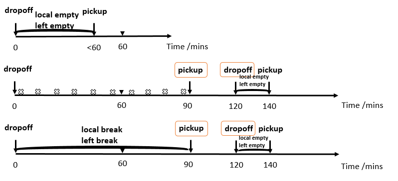

---

# R codes for Taxi Market Inefficiency Analysis: Mismatched Trips (2015-01-01 to 2017-06-30)
# AnalyseTransMktInefficiency_Stage1to3.Rmd 

## Project Overview
This project partitions a day into sub-time-intervals and analyse the taxi drivers’ behaviours to shed light on Singapore local transport market efficiency in each sub-time-interval in a day, providing comprehensive insights into the efficiency of Singapore's taxi market during 2016-2017, identifying temporal and spatial patterns of inefficiency.

For the first time, by establishing the market inefficiency metrics with optimized calculation algorithm this project analyzes taxi operational statuses in each 5-minute intervals (288 intervals/day) across 170,478 unique taxi IDs operating in Singapore during 2015-01-01 to 2017-06-30.

This project was funded and in collabration with LTA. The local taxi operators involved in the analyzed taxi data are: CDG, Premier, SMRT, TransCab. (All the data used are unfortunately not accessible now for confidential reason.) Here's a breakdown of what the script does.

## Notable Features:

### Key Outputs (of AnalyseTransMktInefficiency_Stage1to3.RmD)

The RmD generates multiple CSV files with detailed metrics including:
 - 1. **Percentage breakdowns of booking types** (phone, TPB, street hail)
 - 2. **Supply composition** (local/foreign pickups, empty cruising, breaks)
 - 3. **Inefficiency metrics by time of day and geographical area**
 - 4. Both short-form (friction+mismatch) and long-form (including efficient pickups) analyses

**Technical Details for R programing performance optimization**
- Uses data.table for efficient large data processing
- Implements custom functions for status identification and metric calculation
- Processes data in batches to manage memory usage
- Handles warnings and missing data appropriately

### 1. Noval Analysis Framework of Taxi Status Types and Market Inefficiency Metrics
- **Left empty**, a binary variable takes 1 if the taxi left its last dropping off area empty and made a subsequent pick up in a different area in less than or equal to 60 minutes, otherwise 0.
- **Local empty**, binary
- **Local pickup** (via phone booking, TPB booking, non-booking), binary
- **Foreign pickup** (via phone booking, TPB booking, non-booking), binary
- **Break statuses** (left break, local break), binary
- **Friction**. For each of the 55 planning area, for each 5-min interval $t$,
$$
  friction_t = min\{cumulative\_local\_empty_{t-1}, cumulative\_foreign\_pickups_{t}\}
$$
- **Mismatch**. For each of the 55 planning area, for each 5-min interval $t$,
$$
  mismatch_t = min\{cumulative\_local\_leavers_{t-1}, cumulative\_foreign\_pickups_{t} - friction_t\}
$$
#### Taxi Status Types Illustration



### 2. Granualar Taxi Status Identification up to each 5-min interval across 55 local markets (planning areas of Singapore) during 2.5 years

### 3. Data heavy and computationally heavy
- ~170k taxi IDs
- ~373 million of trips
- complexity introduced by the defined Taxi Status types and Inefficiency metrics 

### 4. Algorithm optimization via vectorization and profiling tools
- Eventually reduced computation time from months to hours.

## Key Components

1. **Data Loading & Preparation (`taxiMismatchAnalysis_2andhalfyr_cleaning.Rmd`)**
   - Clean and save the trip data
   - Organize data with `OrganiseData()` function
   - Create composite IDs for vehicles/drivers

2. **Stage 1: Taxi Status Identification (`IdentifyTaxiStatus_v17.R`)**
   - Process data in chunks of 1000 vehicles
   - Use `IdentifyTaxiStatus()` to classify each vehicle's status at 5-minute intervals
   - Save individual vehicle status tables

3. **Stage 2: Analysis Data Aggregation (`AccumulateTaxiStatusTables_v1.R`)**
   - Accumulates all individual status tables into one master table
   - Fills missing time intervals with zeros
   - Orders data by area, date and time

4. **Stage 3: Friction & Mismatch Calculation (`CalculateFrictionandMismatch_v3.R`)**
   - Computes friction and mismatch metrics using `CalculateFrictionandMismatch()`
   - Separates results by year (2016, 2017)
   - Generates multiple summary statistics:
     * Pickups over time/area (%)
     * Supply over time/area (%)
     * Inefficiency metrics (short/long versions)

### Technical Notes

1. The script uses several custom functions stored in separate R files:
   - `OrganiseData.R`
   - `PrepareForStage1.R`
   - `IdentifyTaxiStatus_v17.R`
   - `ConvertNAto0.R`
   - `AccumulateTaxiStatusTables_v1.R`
   - `CalculateFrictionandMismatch_v3.R`

2. Key libraries used:
   ```r
   library(data.table) # For fast data manipulation
   library(lubridate)  # For date handling  
   library(rio)        # For data import/export
   library(gsubfn)     # For string manipulation
   library(plyr)       # powerful tool for data manipulation
   library(profileR)   # For identifying bottlenecks and optimizing code performance

   ```

3. The analysis focuses on three booking types:
   - Phone bookings (`pb`)
   - Third-party bookings (`tb`)
   - Street hails (`nonbooking`)

4. Output files are saved with systematic naming conventions including dates.


This is a part of a larger research project analyzing taxi supply-demand dynamics in Singapore, focused on identifying inefficiencies in the taxi marketplace across different locations and times of day. With this analysis and output, statistical models can be built to revealing useful transport market insights and demand and supply.

## Author & Contact  
- **Author**: Jiejie Zhang, National University of Singapore
- **Date**: 2021-12-31
- **Contact**: jiejiezhangsta@gmail.com

---
